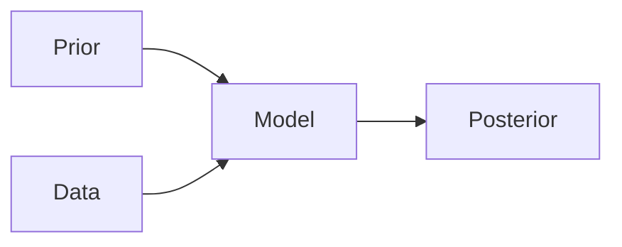
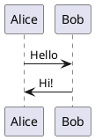

# Math, Diagrams, and Figures

## LaTeX Math

### Inline Math

Use `$...$` for inline equations:

```md
The posterior $p(\theta | y)$ combines prior and likelihood.
```

Keep inline math simple. Complex expressions belong in display mode.

### Display Math

Use `$$...$$` for centered display equations:

```md
$$\Huge
\underbrace{\text{Pr}(\theta | y)}_{\textcolor{yellow}{\small \text{Posterior}}}
=
\frac{
  \overbrace{\text{Pr}(y | \theta)}^{\textcolor{yellow}{\small \text{Likelihood}}}
  \cdot
  \overbrace{\text{Pr}(\theta)}^{\textcolor{yellow}{\small \text{Prior}}}
}{
  \underbrace{\text{Pr}(y)}_{\small \text{Evidence}}}
$$
```

Always size display math with `\Huge` or `\Large`. Default size is unreadable
from the back row.

### Math Sizing Commands

| Command | Size |
|---------|------|
| `\tiny` | Very small |
| `\small` | Small (good for subscripts) |
| `\normalsize` | Default |
| `\large` | Slightly larger |
| `\Large` | Large |
| `\LARGE` | Very large |
| `\huge` | Huge |
| `\Huge` | Maximum (preferred for displayed equations) |

### Color in Math

Use `\textcolor{color}{text}` for emphasis:

```md
$$\Large
\textcolor{blue}{\alpha} \sim \text{Normal}(0, 10)
$$
```

Available colors depend on the theme. Neversink supports standard LaTeX colors
plus Tailwind-like names.

### Underbraces and Overbraces

Label parts of equations:

```md
$$\Huge
\underbrace{\text{Posterior}}_{\text{What we know}}
\propto
\overbrace{\text{Likelihood}}^{\text{Data}}
\times
\underbrace{\text{Prior}}_{\text{What we believed}}
$$
```

## Mermaid Diagrams

For flowcharts, sequence diagrams, and graphs:

````md

````

Mermaid is useful for:
- Workflow diagrams
- Model architectures
- Decision trees
- System diagrams

Keep diagrams simple. Avoid more than 6 nodes per diagram.

## PlantUML

For more complex diagrams:

````md

````

PlantUML requires Java. Mermaid is preferred unless you need specific
PlantUML features.

## Images as Figures

### Simple Image

```md

```

### Sized Image

```md

```

### Image with Caption

```md
<figure>
  
  <figcaption>Figure 1: Posterior predictive check</figcaption>
</figure>
```

### Full-Screen Figure

```md
---
layout: image
image: /images/figure.png
---

<div class="absolute bottom-10 left-10 bg-black/50 p-4 rounded">
  Figure 1: Posterior predictive check
</div>
```

## Data Visualization Best Practices

When including plots and charts:

- Use large fonts on axes (minimum 12pt in the source figure)
- Ensure color palettes are colorblind-safe (avoid red-green combinations)
- One message per figure. Split complex multi-panel figures across slides
- Add annotations directly on the figure rather than explaining in text
- Use consistent styling across all figures in a deck

## Grid Layouts for Multiple Figures

```md
<div class="grid grid-cols-2 gap-4">
  
  
</div>
```

Use `gap-4` minimum. Ensure all images in a grid share the same aspect ratio.
